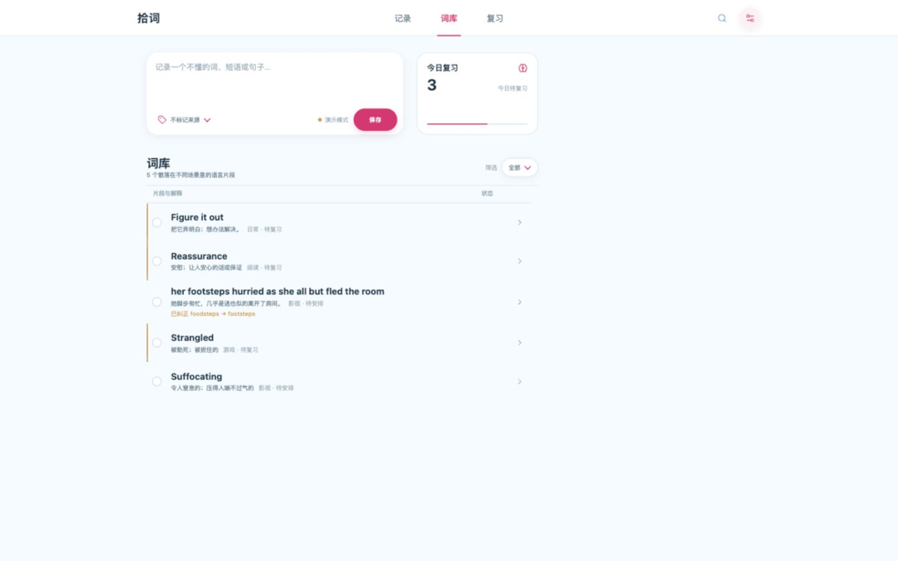
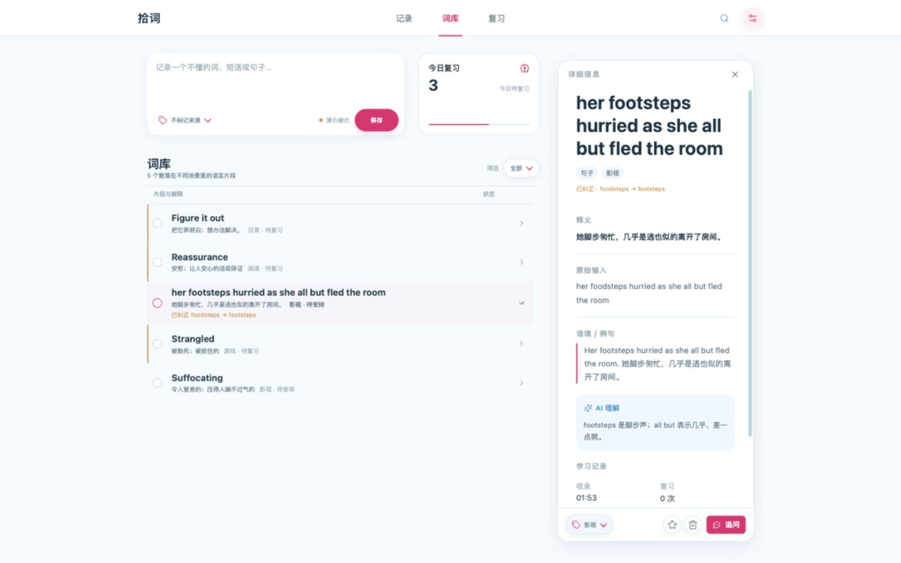

<div align="center">


# 拾词 · Shici

**随手拾起遇到的语言片段，让 AI 讲清楚，再按你的遗忘节奏还回来。**

<p><em>A local-first companion for the words you stumble on — capture any language fragment, let any OpenAI-compatible model explain it, and review it on a schedule that adapts to your memory. All data stays on your machine.</em></p>

[](LICENSE)
[](https://github.com/MarchPhantasia/shici/actions/workflows/ci.yml)
[](#跨平台构建)
[](package.json)

</div>

---

## v0.5.0：从记录到理解的完整工作台

这是拾词目前最完整的一次版本：它把碎片化记录、AI 解释、连续追问、遗忘曲线复习和本地数据管理放进同一套工作流。你可以只记录一个单词，也可以记录短语、句子或一段上下文；每条内容都独立保存，不会被其他历史对话污染。

本版本重点包括：

- **追问工作台**：围绕词条连续追问，支持 `@` 选择词条、保留问答记录、回退早期轮次，并可并行停止请求。
- **更可靠的复习**：单词详情、语境、AI 理解和追问结论都能在复习中使用，四档反馈会调整下一次复习间隔。
- **任意模型 Provider**：可保存多个 Responses API / Chat Completions Provider，从 `/v1/models` 获取模型，也可直接填写模型 ID。
- **批量导入与 WebDAV**：历史 LLM 对话可按结构化 JSON 追加进现有词库；配置 WebDAV 后可增量合并词库与复习状态。
- **本地优先**：词库、复习进度、追问记录和 Provider 配置默认保存在本机，更新应用不会覆盖已有数据。

### 界面预览

下面的截图来自实际界面，分别展示词库总览、长句详情和专注复习。点击词库中的条目可以打开完整详情，长句不会被列表截断；复习页则只保留当前卡片与四档反馈，适合连续操作。

| 词库总览 | 长句与 AI 详情 | 专注复习 |
| :--: | :--: | :--: |
|  |  |  |

macOS Apple Silicon 安装包：[`shici-0.5.0-macos-arm64.dmg`](https://github.com/MarchPhantasia/shici/releases/latest)。

---

## 为什么做这个

读一本书、看一集剧、刷一条推，卡住你的往往不是"一个生词"，而是一个短语、半句话、一种语气。

- **单词 App** 只吃孤立单词，短语和句子塞不进去。
- **聊天机器人** 能解释，但对话划走就没了，留不下任何可复习的东西。

拾词把 **捕捉 → 理解 → 复习** 三件事收进同一个界面，数据完全留在本机。

---

## 界面

| 词库 | 详情 | 复习 |
| :--: | :--: | :--: |
|  |  |  |

---

## 特性

### 📥 任意粒度的捕捉

单词、多个单词、短语、整句、对话、路牌、聊天记录 —— 任何语言片段都能直接发送，不必先归类。

每次提交默认都是**独立片段**，不会携带其他条目的上下文。可选标记来源（日常 / 阅读 / 影视 / 工作 / 游戏 / 网页 / 聊天 / 其他），之后可按来源筛选。

### 🧠 AI 解释，能追问，能回退

AI 会先判断片段类型，再给出**贴合当前语境**的中文理解，而不是罗列词典义项。

- **单词** 保存音标；**一次发多个词**会自动拆成独立条目，各自保存音标、释义、语境与例句，不会误合并成短语。
- **明显拼写错误**会在解释前纠正 —— 原始输入保留用于核对，纠正后的文本用于解释与复习。词形还原、大小写规范不会被误标成"纠错"。
- 点击「追问」可以就同一片段继续提问；只有此时才会把原片段、归纳结论和**最近几轮**追问发给 AI。
- 追问可以**回退**到原片段或任一较早轮次，之后的上下文会一并移除。
- 生成期间发送按钮变为停止按钮，**停止后不写入任何内容**。
- 词库里已有的片段会提示复用，也可以选择「仍然新建」。

### 🔁 自适应复习

复习调度受艾宾浩斯遗忘规律启发，根据你的四档反馈动态调整下次出现时间，而不是套用固定日程表。

| 按键 | 档位 | 效果 |
| :-: | --- | --- |
| `1` | 忘记 | 10 分钟后重来，难度系数下调 |
| `2` | 困难 | 间隔小幅增长 |
| `3` | 记得 | 按当前难度系数增长 |
| `4` | 轻松 | 间隔大幅增长，难度系数上调 |

- `Space` 显示答案，`1`–`4` 评分，全程无需鼠标。
- 反复遗忘（累计 8 次）的片段会被标为**顽固词**单独提示。
- 每张卡片带有稳定的间隔抖动，避免同一天录入的词永远堆在同一天到期。

### 🗄️ 本地优先

- 片段、来源、复习状态、追问记录全部保存在**系统应用数据目录**，不上传任何服务器。
- 写入采用「临时文件 + 原子替换」，文件权限 `0600`，目录权限 `0700`。
- 支持 **JSON 导入 / 导出**，备份和迁移都在你手里。
- 删除、回退、恢复演示数据等破坏性操作均提供 **8 秒撤销窗口**。

### 🔌 任意 OpenAI 兼容模型

- 可保存并快速切换**多个 Provider**，各自独立配置接口方式、Base URL、API Key、模型与推理强度。
- 支持 **Responses API**（`/v1/responses`）与 **Chat Completions**（`/v1/chat/completions`）。
- 自动协商结构化输出（JSON Schema）与推理参数，**不支持的能力会自动降级并缓存**，不会每次请求都重试失败路径。
- 模型列表可从 `/v1/models` 拉取，也可直接填写任意模型 ID。
- 支持无密钥的本地推理服务（Ollama / vLLM / SGLang / LM Studio 等）。

### 💬 追问工作台

顶部或底部导航进入「追问」工作台。点击词库详情里的「追问」或复习卡的「再问一句」会带着当前词条进入笔记区；也可以在工作台输入框按 `@` 打开词条选择器，用自己的搜索词定位锚点。追问索引按最近理解排序，右侧笔记保留问答、记忆结论、复制与回退；多个词条可以同时请求，索引行和笔记区各自提供停止操作。

记录新片段仍使用「记录」页或词库上方的记录框，两者只创建新的词条，不会意外沿用追问上下文。

### 🎨 界面

不使用传统聊天侧栏。词库是可搜索、可按来源筛选的高密度列表，解释按需展开；单击标题或双击词条打开完整阅读卡片，长句不会被截断；复习进入独立的专注模式。

跟随系统 / 浅色 / 深色三种主题，阅读字号可在 `90%`–`120%` 之间调整。外观偏好只保存在本机。

---

## 安装

### 下载安装包

前往 [Releases](https://github.com/MarchPhantasia/shici/releases) 下载对应平台的安装包。

当前稳定发布为 **v0.5.0**，提供 macOS Apple Silicon `.dmg` 安装包。

> 当前发布 macOS `.app` / `.dmg`。其余平台请见下方「跨平台构建」。

### 浏览器版（也是开发版）

```bash
git clone https://github.com/MarchPhantasia/shici.git
cd shici
npm install
npm start
```

打开 `http://127.0.0.1:4173`。未配置 AI 时会进入**明确标记的演示模式**，功能可完整体验，只是不会真的调用模型。

> 本地服务只监听 `127.0.0.1`，并校验 `Host` / `Origin` / 自定义请求头，防止其他网页越权访问你的词库和 API Key。

### 跨平台构建

桌面与移动端基于 **Tauri 2**，复用同一套静态界面与 Rust 本地后端，**不捆绑 Chromium 或 Node 运行时**。

```bash
npm run app:dev     # 开发模式
npm run app:build   # 构建安装包
```

同一份源码与图标已面向 macOS、Windows、Linux、iOS、Android 准备就绪；各平台产物需在对应系统及其签名 / SDK 环境中构建。

---

## 接入 AI

在应用内「设置 → AI Provider」中配置：

| 字段 | 说明 |
| --- | --- |
| **API 方式** | `Responses API` 或 `Compatible`（Chat Completions） |
| **Base URL** | 自动规范到 `/v1`，仅支持 http / https |
| **API Key** | 只保存在本机；页面只能读取"是否已配置"，无法取回 |
| **模型** | 可从 `/v1/models` 拉取候选，也可直接输入任意 ID |
| **推理强度** | 自动 / 关闭思考 / 低 / 中 / 高 |
| **无密钥服务** | 勾选后可对接不需要 API Key 的本地服务 |
| **`chat_template_kwargs`** | 自建 vLLM / SGLang 需要时勾选 |

也可以用环境变量作为初始配置：

```bash
AI_API_STYLE=responses          # responses | compatible
AI_BASE_URL=https://api.openai.com/v1
AI_API_KEY=sk-...
AI_MODEL=gpt-4o
AI_REASONING_EFFORT=auto        # auto | none | low | medium | high
AI_ALLOW_NO_KEY=1               # 无需密钥的本地服务
```

兼容 `OPENAI_API_KEY` / `OPENAI_BASE_URL` / `OPENAI_MODEL`。

---

## 批量追加历史记录

如果已有大量词汇对话，可以把 [`docs/import-prompt.md`](docs/import-prompt.md) 发给其他 LLM，再把历史对话接在 prompt 后面。它会输出符合 [`docs/import-format.schema.json`](docs/import-format.schema.json) 的 JSON 文件。

在“设置 → 追加导入 JSON”选择文件即可。导入只追加，不会替换现有词库；raw 或 displayText 相同（忽略大小写和首尾空白）的记录会自动跳过，现有复习进度与 Provider 配置不会受影响。

---

## 数据与隐私

**除了你主动发起的模型请求，拾词不与任何服务器通信。** 没有遥测，没有账号，没有云同步。

安装版数据位于系统应用数据目录，不放在应用包内：

| 平台 | 路径 |
| --- | --- |
| macOS | `~/Library/Application Support/com.pha.shici/` |
| Windows | `%APPDATA%\com.pha.shici\` |
| Linux | `$XDG_DATA_HOME/com.pha.shici/`（未设置时为 `~/.local/share/com.pha.shici/`） |

- `settings.json` —— Provider 配置与 API Key
- `library.json` —— 片段、来源、复习状态、追问记录

两者均以私有权限原子写入。升级或重装不会覆盖已有数据。可用 `SHICI_DATA_DIR` 覆盖默认目录。

**发送给模型的内容**仅限：当前片段本身；追问时额外附带原片段、归纳结论与最近几轮问答。其他词条永远不会进入请求。

---

## 键盘快捷键

| 快捷键 | 场景 | 动作 |
| --- | --- | --- |
| `⌘/Ctrl + Enter` | 输入框 | 发送（可在设置中改为 `Shift + Enter` 或 `Enter`） |
| `Enter` | 输入框 | 换行（取决于上面的设置） |
| `Space` | 复习 | 显示答案 |
| `1` `2` `3` `4` | 复习 | 忘记 / 困难 / 记得 / 轻松 |
| `Esc` | 设置弹窗 | 关闭 |

---

## 开发

```bash
npm start          # 浏览器开发版 → http://127.0.0.1:4173
npm run check      # 语法检查 + ESLint
npm test           # 端到端冒烟测试（含 mock 上游）
npm run ci         # 完整闸门：check + test + fmt + cargo test + release build + clippy
npm run migrate    # 将旧版 .local/ 数据迁移到应用数据目录
```

提交前请跑 `npm run ci` —— CI 走的是同一条命令，本地绿了远端就绿。

### 项目结构

```
server.mjs              浏览器开发版的本地服务端（Node）
public/                 前端（原生 JS，无构建步骤）
  ├─ app.js             全部交互逻辑
  ├─ styles.css         样式
  └─ index.html
src-tauri/src/lib.rs    桌面 / 移动端的 Rust 本地后端
system-prompt.txt       AI 提示词（双端共用的唯一来源）
test/smoke.mjs          端到端测试
scripts/data-root.mjs   跨平台数据目录解析（双端共用）
```

> 前端**不需要打包**：`public/` 直接就是产物，Tauri 与 Node 服务端都直接托管它。

### 技术栈

原生 JavaScript · Node.js（开发服务端）· Rust + Tauri 2（桌面 / 移动端）· 零前端依赖（仅内嵌 Lucide 图标）

---

## 已知限制

- 目前仅在 macOS 上完成构建验证；Windows / Linux / iOS / Android 需在对应环境自行构建并验证。
- 词库列表未做虚拟滚动，超大词库（万条以上）滚动性能会下降。
- 解释为一次性返回，尚未实现流式输出。
- 界面仅有中文。

---

## 设计

`design/` 保存通过 Stitch MCP 生成的界面基准稿。实现保留了其顶部工作区、紧凑捕获、密集词库与按需详情的思路，并针对真实数据量、专注复习与移动端操作重新完成了信息架构。

应用图标的生成提示词见 [`design/icon-prompt.md`](design/icon-prompt.md)。

---

## License

[AGPL-3.0-only](LICENSE) © MarchPhantasia

> AGPL-3.0 要求：任何基于本项目的修改版本，**包括通过网络提供服务的形式**，都必须以相同协议开放源代码。
